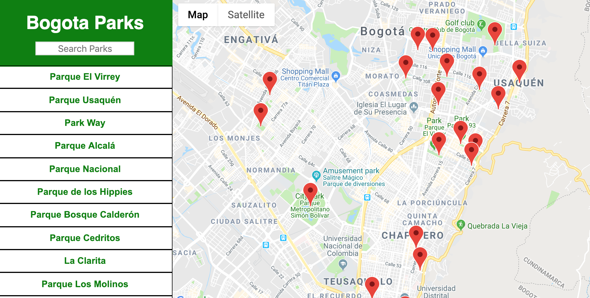

# Parks Map in Bogota - Colombia

This is the final project of the Udacity Front-End Nanodegree.
I created the map with Bogota parks with the ability to search

## Overview

I built a single page application featuring a map of some important sights in Thessaloniki, Greece, the city I live in. I added functionality to this map including highlighted locations, third-party data about those locations and various ways to browse the content.


## Getting Started

Follow the instructions below:

Download or clone the repository in your computer:
```
$ git clone
$ cd into project folder
$ npm install
$ npm install react-google-maps --save
$ npm install escape-string-regexp --save
$ npm start
```
* open [http://localhost:3000](http://localhost:3000) to view it in the browser.

## Dependencies & Tools Used

* The project was generated with [creat-react-app](https://reactjs.org/docs/create-a-new-react-app.html).
* For this project I used `Google Maps API`.
* For this project I used `FourSquare API`.


## Screenshot


